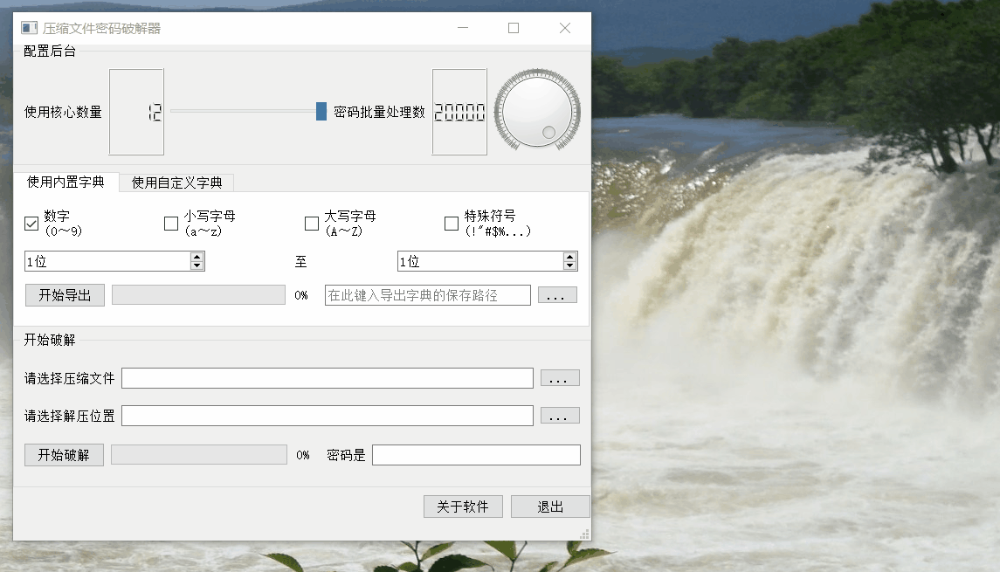

# 压缩包密码破解
This repository provides codes to crack archive with password
## Privacy Policy
You need select the archive file that you want to crack. In the newest version, this application will crack the archive password by enumerating passwords that you can config in this software. We will not collect any information from your archive file.
## 隐私策略
你需要在软件中选择要破解的压缩文件。在最新版本中，该软件通过暴力枚举密码的方式来破解压缩包密码，你可以在软件中配置你需要枚举的密码。我们将不会从你的压缩文件中收集任何信息。
## 主要功能
通过暴力枚举的方式，破解压缩包密码，后期将搭建md5-password共享平台。
## 截图展示
<br />
<br />
<br />
## 使用说明
### 方法一：直接运行exe文件
使用release版本：运行main.exe
### 方法二：通过python运行脚本
本项目使用python3.7.3构建，依赖库已保存至文件requirements.txt，cd到该目录下，依次执行以下命令<br />
```
python -m venv
pip install -r requirements.txt
```
## 版本迭代
### 0.1.0.0
支持内置字典以及外部字典破解<br />
支持将内置字典导出至外部文件<br />
通过多进程读写文件方式提速<br />
简单的UI窗口<br />
### 1.0.0.0
新增.rar文件支持<br />
后台多进程任务使用生产者消费者模式<br />
优化代码执行逻辑<br />
修复后台任务运行时，主界面卡死的bug<br />
新增导出字典，破解的进度展示，优化用户体验<br />
修复若干bug<br />
### 1.1.0.0
优化用户界面展示逻辑<br />
修复若干bug<br />
### 1.2.0.0
新增停止功能：停止导出字典任务、停止破解任务<br />
修复若干bug<br />
新增动图展示<br />
通过类型Type-hinting兼容PyCharm语法提示<br />
改善后台逻辑，提高运行效率<br />
### 1.2.1.0
修复一些bug<br />
